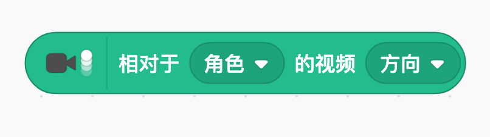
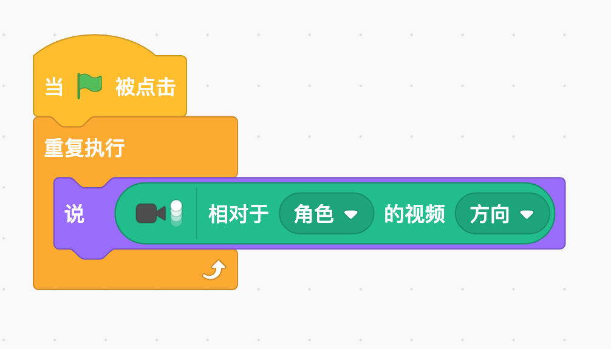

# 作业回顾
- 桌球
- 自己的项目进度

---

# 头球

---

### 演示

<iframe data-src="https://kada.163.com/project/4085806-3400155.htm" width="800" height="560" frameborder="0" marginwidth="0" marginheight="0" scrolling="yes" style="border:3px solid #666; margin-bottom:5px; max-width: 100%;" allowfullscreen=""></iframe>

---

# Play
- 添加视频侦测模块
-  5分钟， 探索一下， 有什么功能？ 可以用来干什么？
- 10分钟， 请两位同学分享一下。有什么功能， 可以用来干什么？

--

## 讲解
- 视频侦测里面， 哪些可以用？

--

### 有点像的， 是这个两边圆形的积木。

--

### 怎样知道它的值？

---

# 讨论
- 用摄像头，怎么做头球？
- 为什么球能反弹？

---

### 1. 请大家完成

- [ ] 球角色
- [ ] 球碰到舞台边缘反弹
- [ ] 头顶到球，球反弹
- [ ] 顶到一次球，加一分
- [ ] 头没顶到球，结束

---

## 怎么侦测头顶球？

---

- 相对于角色的运动
- 

---

## 怎么反弹？

---

- 将球方向变为反方向
- 

---

## 怎么表示没顶到球？

---

- y坐标的范围？
- 

---

# 回顾： 你学到了什么？

--

- 摄像头{.fragment .fade-up}
- 反射角度 {.fragment .fade-up}

---

## 课后练习

--

做一个“吃汉堡”的游戏。 玩家在摄像头前， 用嘴巴一口咬掉屏幕上的汉堡。

---
